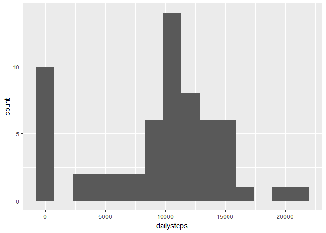
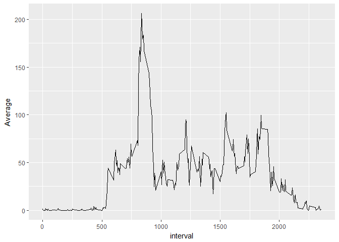
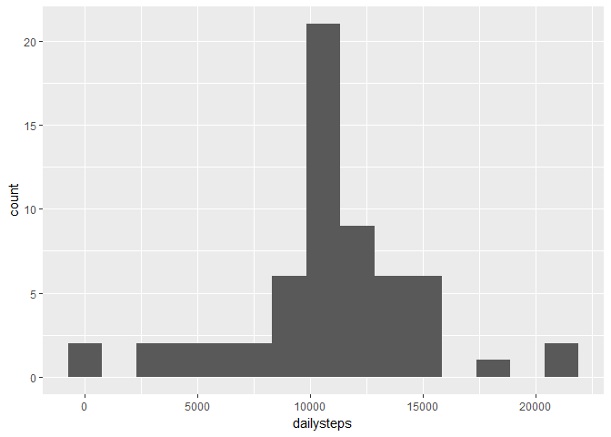
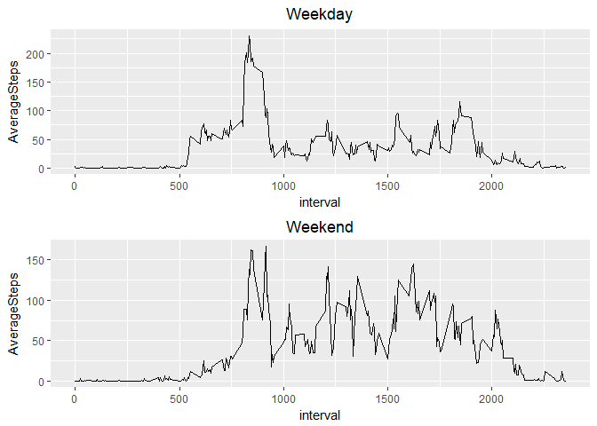

## Loading and preprocessing the data

```r
setwd("C:/Users/Owner/OneDrive/R/repdata")
unZip<-unzip("C:/Users/Owner/OneDrive/R/repdata/activity.zip")
rawdata<-read.csv("C:/Users/Owner/OneDrive/R/repdata/activity.csv", header = T, sep = ",")
processdata<-rawdata %>%
    group_by(date) %>%
    summarise(dailysteps = sum(steps, na.rm = T))
```

## What is mean total number of steps taken per day?

```r
steps.mean<- mean(processdata$dailysteps)
steps.median<- median(processdata$dailysteps)
c(steps.mean, steps.median)
```

```
## [1]  9354.23 10395.00
```
##### Mean : 9354.2295082
##### Median : 10395
###
#### Histgram of the total number of steps taken per day

```r
g1<-ggplot(data = processdata, aes(x = dailysteps))
steps.hist<- g1 + geom_histogram(bins = 15)
steps.hist
```

<!-- -->

## What is the average daily activity pattern?
#### 1.Plot the pattern

```r
patterndata<-rawdata %>%
    group_by(interval) %>%
    summarise(Average = mean(steps, na.rm = T) )
g2<-ggplot(data = patterndata, aes(x = interval,y = Average, group = 1))
steps.pattern<- g2 + geom_line()
steps.pattern
```

<!-- -->
### 
#### 2.Calculate the interval of MAX steps

```r
interval.max<-with(patterndata, interval[which.max(Average)])
interval.max
```

```
## [1] 835
```
##### The max steps interval : 835

## Imputing missing values

#### 1. Calculate and report the total number of missing values in the dataset.

```r
na.number<- sum(is.na(rawdata$steps))
na.number
```

```
## [1] 2304
```
#### There are 2304 missing values in total.
###
#### 2. Creat new dataset then fill the missing value with 5-minutes interval mean.(I kept the original dataset.)

```r
repeat.pattern <- round(rep(patterndata$Average,length(processdata$date)))
data.repaired <- rawdata
na.index <- which(is.na(data.repaired$steps))
data.repaired$steps[na.index]<-repeat.pattern[na.index]
```
#### 3. Plot the histgram of the total number of steps taken per day by new dataset

```r
processdata.new<-data.repaired %>%
    group_by(date) %>%
    summarise(dailysteps = sum(steps, na.rm = T))
g3<-ggplot(data = processdata.new, aes(x = dailysteps))
steps.hist2<- g3 + geom_histogram(bins = 15)
steps.hist2
```

<!-- -->
#### 4. The new mean and median value

```r
steps.mean2<- mean(processdata.new$dailysteps)
steps.median2<- median(processdata.new$dailysteps)
c(steps.mean2, steps.median2)
```

```
## [1] 10765.64 10762.00
```
##### Mean : 9354.2295082, New Mean : 10765.64
##### Median : 10395, New Median : 10762
###
##### The values are different from the originals because of the replacement of NA values increase overall value of the dataset.

## Are there differences in activity patterns between weekdays and weekends?
###
#### 1.Create a new factor variable in the dataset with two levels - “weekday” and “weekend” indicating whether a given date is a weekday or weekend day.

```r
data.date<-data.repaired
isweekend<- wday(data.date$date) %in% c(1, 7)
isweekday<- wday(data.date$date) %in% 2:6
weekend<- data.date[which(isweekend),]
weekday<- data.date[which(isweekday),]
```
#### 2. Make a panel plot containing a time series plot of the 5-minute interval (x-axis) and the average number of steps taken, averaged across all weekday days or weekend days (y-axis). 

```r
patterndata.weekday<-weekday %>%
    group_by(interval) %>%
    summarise(AverageSteps = mean(steps, na.rm = T) )
g4<-ggplot(data = patterndata.weekday, aes(x = interval,y = AverageSteps, group = 1))
weekday.pattern<- g4 + geom_line() + ggtitle("Weekday") +  theme(plot.title = element_text(hjust = 0.5))
patterndata.weekend<-weekend%>%
    group_by(interval) %>%
    summarise(AverageSteps = mean(steps, na.rm = T) )
g5<-ggplot(data = patterndata.weekend, aes(x = interval,y = AverageSteps, group = 1))
weekend.pattern<- g5+ geom_line() + ggtitle("Weekend") +  theme(plot.title = element_text(hjust = 0.5))
grid.arrange(weekday.pattern,weekend.pattern, ncol = 1)
```

<!-- -->
